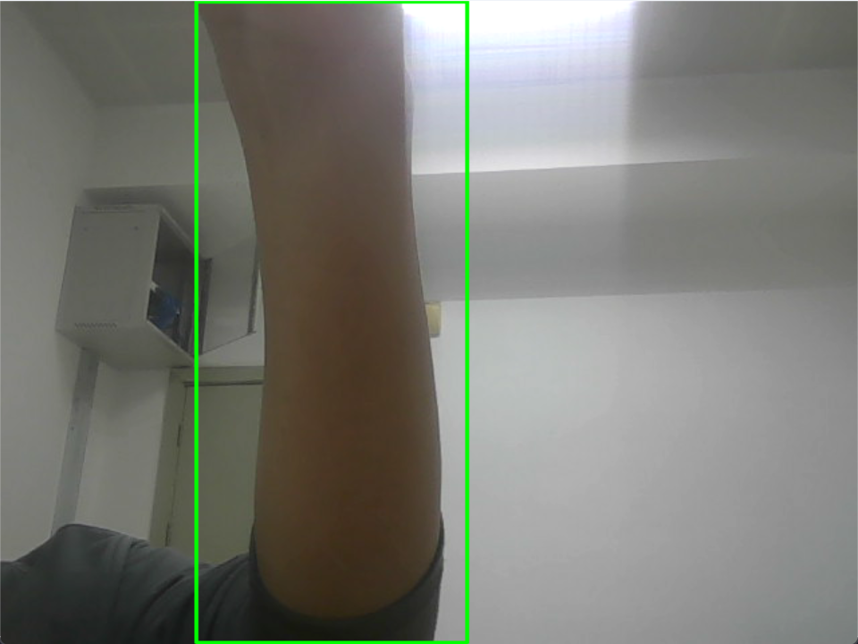

# 手部检测实现文档

## 1. 概述

本文档详细说明了使用传统计算机视觉方法实现手部检测的思路和具体实现。该方法主要基于肤色检测和轮廓分析，能够实时检测多个手部区域。

## 2. 实现原理

### 2.1 肤色检测

- 使用YCrCb颜色空间进行肤色检测
- YCrCb比RGB更适合肤色检测，因为它将亮度和色彩信息分离
- 使用预定义的阈值范围：

  ```python
  min_YCrCb = [0, 133, 77]
  max_YCrCb = [255, 173, 127]
  ```

### 2.2 图像预处理

- 形态学操作用于改善检测效果：
  - 腐蚀操作去除噪点
  - 膨胀操作填充空洞
  - 使用椭圆形结构元素：`cv2.MORPH_ELLIPSE, (5, 5)`

### 2.3 手部区域提取

- 轮廓检测和筛选：
  - 使用`cv2.findContours`找到所有轮廓
  - 基于面积阈值筛选手部区域：
    - 最小面积：5000像素
    - 最大面积：50000像素
- 边界框处理：
  - 为每个检测到的手部添加padding
  - 确保边界框不超出图像范围

## 3. 核心功能

### 3.1 HandDetector类

主要方法：

1. `detect_skin(image)`:
   - 输入：BGR图像
   - 输出：二值化的肤色掩码
   - 功能：识别图像中的肤色区域

2. `find_hand_contours(mask)`:
   - 输入：二值化掩码
   - 输出：符合面积条件的轮廓列表
   - 功能：找到可能的手部轮廓

3. `detect_hands(image)`:
   - 输入：原始图像
   - 输出：标注后的图像和手部ROI列表
   - 功能：检测并标注所有手部区域

## 4. 使用方法

### 4.1 基本用法


