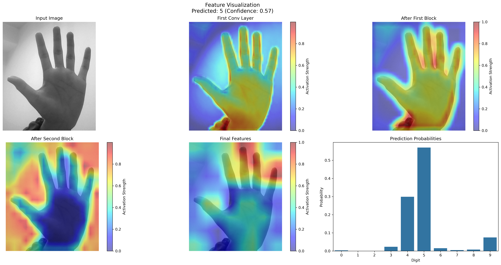
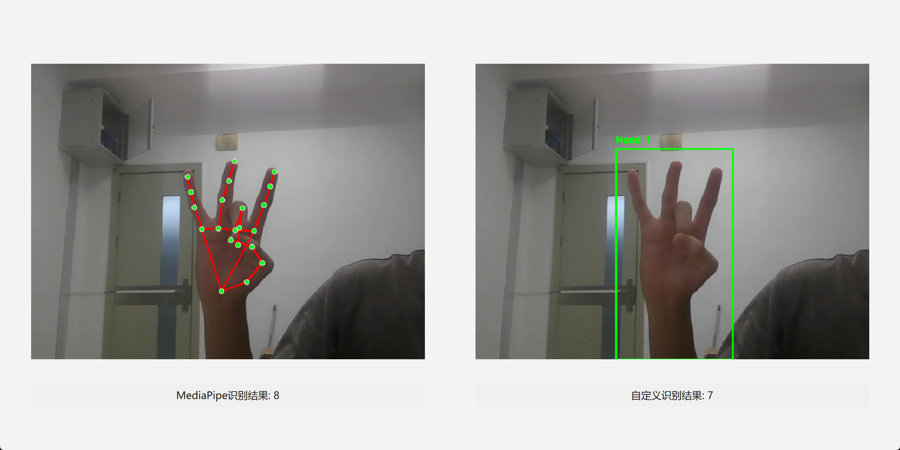

# 基于深度学习和计算机视觉的实时手势数字识别

本项目实现了一个基于改进ResNet的实时手势数字识别系统，结合传统计算机视觉和深度学习技术，实现对土耳其手势数字（0-9）的准确识别。  

数据集 [Sign-Language-Digits-Dataset](https://www.kaggle.com/datasets/ardamavi/sign-language-digits-dataset)  

  
(执行`python train/model_visualization.py`的结果)  

(执行`python main.py`的结果)

## 项目结构
```
├── config.py           # 配置文件
├── main.py            # 主程序入口
├── utils.py           # 工具函数
├── models/            # 模型定义和权重
├── detection/         # 检测相关模块
│   └── hand_detection_cv.py  # 基于OpenCV的手部检测
├── recognizers/       # 识别器模块
├── train/            # 训练相关代码
│   ├── dataset.py    # 数据集处理
│   ├── train.py      # 训练脚本
│   └── show_data.ipynb # 数据可视化
├── test/             # 测试脚本和图片
│   ├── testimg/      # 测试图片目录
│   ├── detect_test.py
│   ├── test_model.py
│   └── test_real_images.py
└── ui/               # 用户界面组件
```

因模型参数过大 因此这里不上传了 可以通过下面的*train*自己训练  

其中`new_model.pth`是准确率最高的模型 高达`97%`  

## 环境要求

```bash
pip install -r requirements.txt
```

## 实现原理

### 1. 手部检测模块

基于传统计算机视觉方法实现手部区域检测：

1. 肤色检测(YCrCb颜色空间转换)
2. 形态学操作
3. 手部区域提取

### 2. 网络架构设计

本项目基于改进的ResNet实现，主要特点：

1. 特征提取层
   - 三层卷积层：1->32->64->128通道
   - 批量归一化层：提升训练稳定性
   - 最大池化层：特征降维
   - Dropout层：防止过拟合

2. 注意力机制
   - SE (Squeeze-and-Excitation) 模块
   - 自适应特征权重
   - 增强关键区域特征

3. 分类器设计
   - 多层全连接网络：128*8*8->512->256->10
   - ReLU激活函数
   - Dropout正则化

### 3. 数据处理

1. 数据集结构
   - 输入：64x64灰度图像
   - 输出：10类手势数字
   - 数据量：2062张训练图像

2. 数据增强
   - 随机旋转（±15度）
   - 随机平移（±10%）
   - 随机缩放（0.9-1.1倍）
   - 水平翻转（30%概率）
   - 标准化处理（均值0.5，标准差0.5）

### 4. 训练策略

1. 训练参数
   - 损失函数：交叉熵
   - 优化器：Adam
   - 学习率调度
   - 批次大小：32

2. 训练技巧
   - 模型检查点保存
   - TensorBoard可视化
   - 早停机制
   - 交叉验证

### 5. 实时处理流程

1. 图像采集
   - 摄像头实时捕获
   - 图像预处理

2. 手部检测
   - 肤色分割
   - 区域提取
   - ROI裁剪

3. 手势识别
   - 特征提取
   - 分类预测
   - 结果显示

## 使用说明

### 主程序
运行主程序：
```bash
python main.py --help
```

### 测试程序
在 `test` 目录下提供了多个测试脚本：

1. 真实图片测试：
```bash
python test/test_real_images.py --help
```

2. 检测手部的测试：
```bash
python test/detect_test.py --help
```

3. 模型性能测试：
```bash
python test/test_model.py --help
```

### 训练模型
如果需要重新训练模型：
```bash
python -m train.train --help
```

## 测试图片

您可以通过以下步骤测试自己的图片：
1. 将测试图片放入 `test/testimg/` 目录
2. 系统支持常见图片格式（jpg、png、jpeg）
3. 运行测试脚本：
```bash
python test/test_real_images.py --help
```

## 配置说明

您可以在 `config.py` 中修改系统设置，包括：
- 模型参数
- 检测阈值
- 输入图片尺寸
- 其他系统配置
